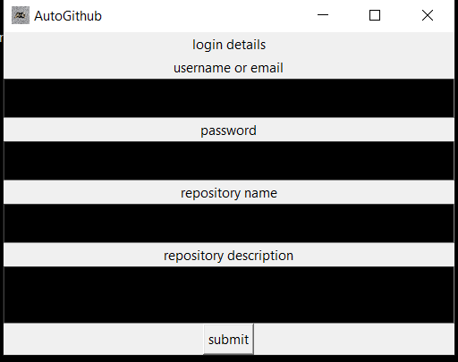

# automate-github

# 🤖 Github Automation Desktop App (Tkinter GUI)

**A Python desktop application for Windows that automates AI tasks through a simple and responsive Tkinter-based GUI.**


---

## 🧠 Overview

This app uses **Python + Tkinter** to provide a lightweight desktop interface for creation of git hub repository:

---

## 🖼️ Screenshot

> *(Add your screenshot in `capture.png`)*

---

## ✨ Features

- 🪟 Native Windows GUI built with Tkinter
- selenium used to create github repository

---

## 📦 Installation

### Requirements

- Windows 10 or 11
- Python 3.12 or newer
- `pip` installed
- new version of google chrome
### Clone & create app by yourself

```bash
git clone https://github.com/automatorplus68-sketch/automate-github.git
cd automate-github
pip install -r requirements.txt
Run the App
bash
Copy code
python AutoGithub.py
📁 Project Structure
bash
Copy code
📦 automate-github
├── AutoGithub.py                # Entry point with GUI
├── Capture.PNG     # UI screenshot
├── requirements.txt
└── README.md
🔧 Build Executable (Optional)
To create a standalone .exe for Windows:

bash
Copy code
pip install pyinstaller
pyinstaller --noconfirm --onefile --windowed --icon="path/of/download.ico" path/of/AutoGithub.py
Output will be generated in the dist/ folder.

🧪 Example Use Cases
this is used to automate creation of github repository

🛠 Dependencies
Example requirements.txt:

txt
Copy code
undetected_chromedriver
selenium
requests
pillow
pywinauto
tk  # built-in, but included for completeness
Generate your full list: pip freeze > requirements.txt

🛡 License
This project is licensed under the MIT License. See the LICENSE file for details.

🙌 Credits


Tkinter Docs

Python Community

🤝 Contributing
Feel free to fork the repo and submit a pull request. For bugs or feature suggestions, open an issue and if you had any ideas of automation please share with me.
if you want this desktop app visit my repository

